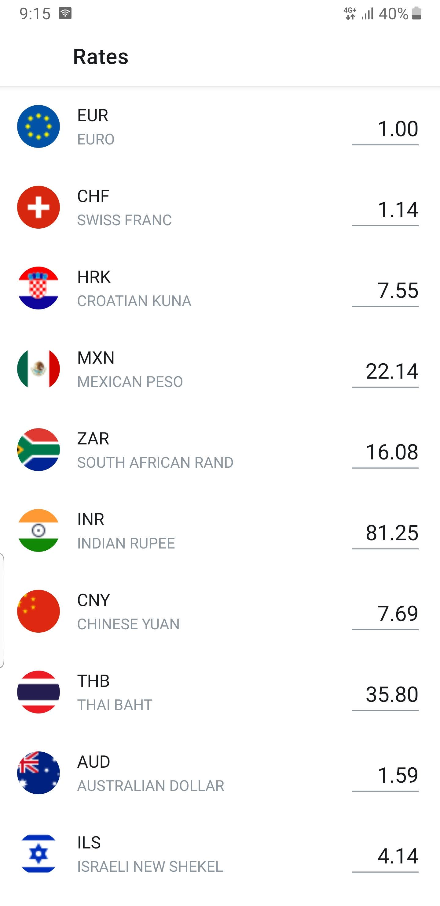
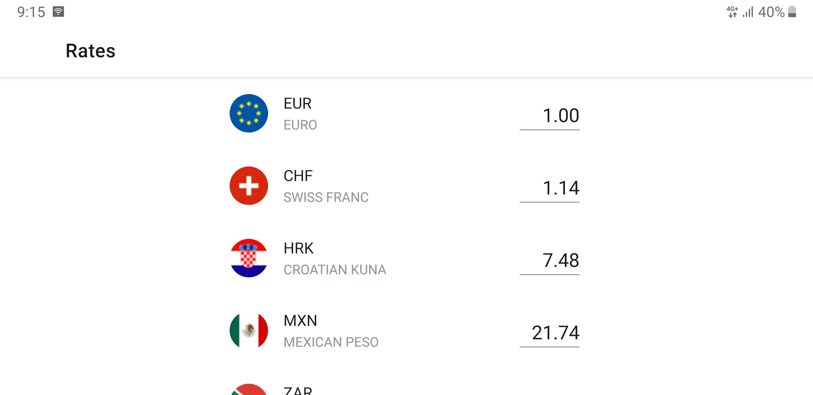

# Currency Converter App

#### An application for converting one currencies into other.

This app will list 20+ different currencies and their rates. You can select any currency adn enter the amount of that currency to convert and app will show converted amount for all 20+ currencies simultaneously. 
This app polls the server to get the latest currency rates every 1 second. If any error occurs and API call fails (due to server error or no network connection), the polling mechanism tries to recover from error automatically. 

## Architecture Highlights:
- Uses MVVM Architecture
- Uses android architecture components such as livedata and ViewModel. 
- Uses dagger2 for dependency injection. This is to provide clear separation between different architecture layers. Helps to write testable code.
- Single activity application.
- Uses retrofit as networking client.


## How to run tests?
- Make sure you connect physical device or run an emulator before running the UI tests.
- To run tests, run following command:
```bash
./gradlew cAT
```

## Acknowledgement:
- This is a sample app and it is not guaranteed that it will show latest rates for each currency. Use it as a demo purposes only. 

## Screenshots 📸:

| Portrait | Landscape | 
|---|---|
|  |  |

## Videos 🎥:

| Orientation Handling | Error Handling| 
|---|---|
|  |  |


## License:
Copyright 2020 Zeynel Erdi Karabulut

Licensed under the Apache License, Version 2.0 (the "License"); you may not use this file except in compliance with the License. You may obtain a copy of the License at

http://www.apache.org/licenses/LICENSE-2.0

Unless required by applicable law or agreed to in writing, software distributed under the License is distributed on an "AS IS" BASIS, WITHOUT WARRANTIES OR CONDITIONS OF ANY KIND, either express or implied. See the License for the specific language governing permissions and limitations under the License.

